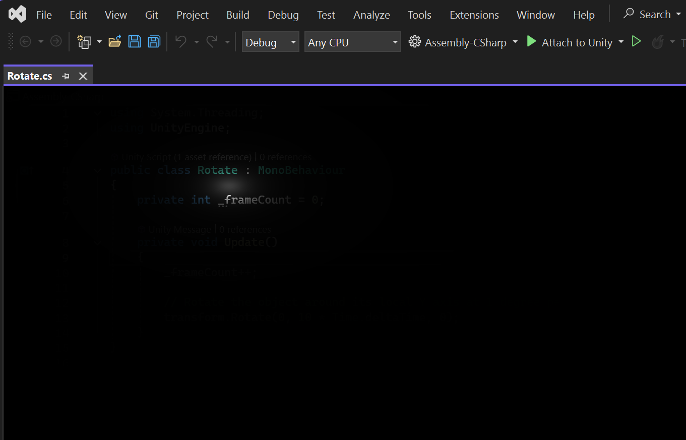
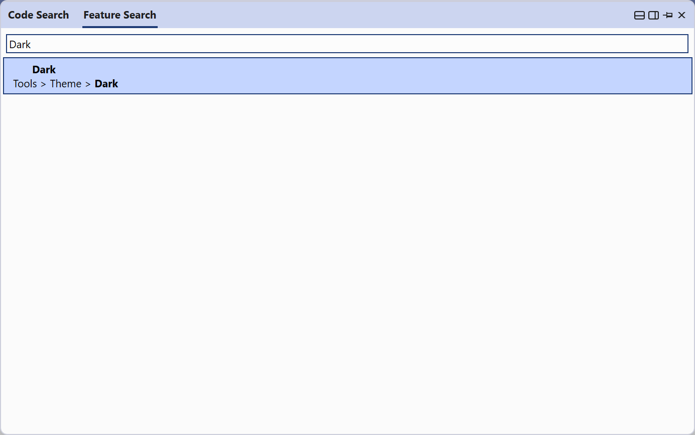

# SpookyVS

A [Visual Studio](https://www.visualstudio.com) extension for Halloween to write code in the dark.

## Getting started

1. Turn on Dark mode (CTRL+Q DARK ENTER)

2. Build and run the SpookyVS extension, or [grab it from the release section](https://github.com/jbevain/SpookyVS/releases/tag/1.0)

3. Play 5 minutes

4. Reset the experimental install or uninstall the extension

## Building locally

You'll need:

1. The Visual Studio extension development workload

2. The Windows SDK 10.0.26100 component to build the pixel shader

3. Open the solution and CTRL+F5 into an experimental instance

4. Tweak the default values in FlashlightEffect.cs if needed

